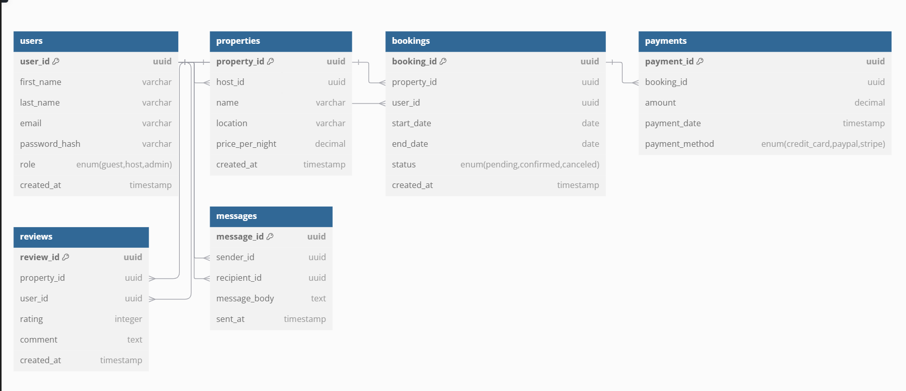

To achieve Third Normal Form (3NF) in your database design, follow these key steps:

### 1. **First Normal Form (1NF)**:
   - **Eliminate Duplicate Columns**: Each column in a table should contain atomic values, meaning no lists or repeating groups.
   - **Uniqueness of Rows**: Ensure each row has a unique identifier (Primary Key).

### 2. **Second Normal Form (2NF)**:
   - **Remove Partial Dependencies**: All non-key attributes should depend on the entire primary key. This is particularly relevant in tables where composite keys are used.
   - **Eliminate Redundant Data**: In the case of multi-column primary keys, ensure that no non-key column depends on just a portion of the key.

### 3. **Third Normal Form (3NF)**:
   - **Eliminate Transitive Dependencies**: No non-key attribute should depend on another non-key attribute. Ensure that all non-key attributes are only dependent on the primary key and not on other non-key attributes.

---

### Normalization Steps for the **Airbnb Database**:

#### **Step 1: Review the Existing Schema**

Upon reviewing the schema from the previous steps, we identify the following potential issues:

1. **Users Table**:
   - No redundancies identified.
   - The `role` column is an enum, which is fine as it contains a finite set of values.

2. **Properties Table**:
   - No immediate issues. All data seems atomic.
   - Foreign key `host_id` links directly to `users.user_id`.

3. **Bookings Table**:
   - The columns in the `Bookings` table appear atomic. However, `total_price` could be derived from `property.price_per_night` and `booking.duration`, making it redundant to store `total_price` explicitly.

4. **Payments Table**:
   - `amount` can be calculated based on the `total_price` and the payment method. However, storing `amount` is acceptable for reporting and performance reasons.
   - `payment_date` is independent and does not create any transitive dependencies.

5. **Reviews Table**:
   - The `rating` and `comment` attributes seem correct, with no violations identified.

6. **Messages Table**:
   - The `message_body` is atomic, but `sent_at` can be used to track message time, and `sender_id` / `recipient_id` are linked properly to `users`.

#### **Step 2: Identify and Remove Redundancies**

Upon review, there are no significant redundant columns in any of the tables, but the following can be optimized:

- **Bookings Table**: Remove `total_price`. This can be calculated dynamically based on `start_date`, `end_date`, and `property.price_per_night`.
- **Payments Table**: The `amount` column is important for historical and reporting purposes, but can technically be calculated from the booking data.

#### **Step 3: Apply 3NF**

The following changes are made to achieve 3NF:

- **Bookings**:
  - `total_price` is removed. Instead, we will calculate it dynamically based on `property.price_per_night * (end_date - start_date)`.

- **Payments**:
  - Keep the `amount` field, but we ensure no transitive dependencies exist (i.e., the `amount` is directly dependent on `payment_id`).

#### **Normalization Markdown**

Here’s how to explain this process in a `normalization.md` file:

---

### Database Normalization (3NF)

#### **Step 1: First Normal Form (1NF)**
All attributes in each table are atomic (no multiple values or arrays), and each row has a unique identifier (`Primary Key`).

#### **Step 2: Second Normal Form (2NF)**
We removed any partial dependencies. Specifically, all non-key attributes depend entirely on the primary key:
- In the **Bookings** table, the columns depend entirely on the `booking_id`, which is the primary key.
- The `host_id` in the **Properties** table is now a foreign key that links directly to the `users` table, ensuring no partial dependencies.

#### **Step 3: Third Normal Form (3NF)**
We eliminated transitive dependencies, ensuring that non-key attributes only depend on the primary key:
- **Bookings**: Removed the `total_price` column since it can be derived dynamically from the `price_per_night` and the duration of the booking (`end_date - start_date`).
- **Payments**: The `amount` field is necessary for reporting and is directly related to the `payment_id`. There are no transitive dependencies here.

#### **Final Schema after Normalization**:
- The schema now respects 3NF, ensuring that data redundancy is minimized, and the database is efficient for queries, updates, and inserts.

### Key Adjustments:
1. **`total_price` Removed from Bookings**: The `total_price` field was removed from the `Bookings` table as it is derived dynamically based on `price_per_night` and booking duration. This aligns with the normalization process to eliminate redundant data.

2. **Added Check Constraint for Reviews**: A constraint was added to the `rating` field in the `Reviews` table, ensuring the rating value is between 1 and 5, as per the normalization process.

3. **No Transitive Dependencies**: All fields are now appropriately linked and no non-key attribute is depending on another non-key attribute (ensuring 3NF).

This code reflects the structure after normalization, ensuring the database follows best practices for data integrity and minimizing redundancy.
